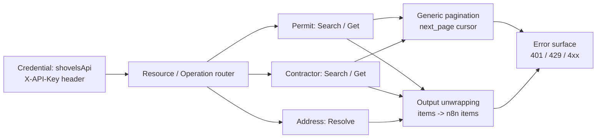

# n8n-nodes-shovels

[](https://github.com/jakemorganlabs/shovels_n8n_nodes/actions/workflows/publish.yml)
[](https://www.npmjs.com/package/n8n-nodes-shovels)
[](https://www.npmjs.com/package/n8n-nodes-shovels)

> A zero-dependency n8n community node for the [Shovels REST API](https://docs.shovels.ai). Building permits and contractors across 1,800+ U.S. jurisdictions. Published from CI with an OIDC-signed provenance attestation.

**Status:** `v1.0.0` on [npm](https://www.npmjs.com/package/n8n-nodes-shovels) with OIDC-signed build provenance. Creator Portal verification is **pending** (operator step). Pre-shield the claim is "published with OIDC-signed build provenance; verification in review." Never claim verified until the shield is granted.

## What it does

Pick a resource (`Permit`, `Contractor`, `Address`), pick an operation (`Search`, `Get`, `Resolve`), set the fields. The node handles the authenticated HTTP calls, cursor pagination, and response unwrapping. No code inside the workflow.

The integration is routing configuration only: JSON + TypeScript declarations. No runtime HTTP client, no parser library, no state, no dependency beyond n8n's peer contract. Built against an SRS/TDD with acceptance criteria. Not an ad-hoc script.

## Architecture

n8n reads the `description` object, renders the UI, and runs the HTTP lifecycle on its own transport.



The credential authenticates every request. The router selects endpoint and method. Search operations attach generic cursor pagination that walks `next_page` until exhausted. All operations unwrap the `items` array so each API record becomes one n8n output item. Errors surface as typed n8n errors: 401 credential, 429 retryable, empty result a valid query with no matches. Zero imperative business logic.

## Operations

| Resource | Operation | Endpoint | Pagination | Notes |
|----------|-----------|----------|------------|-------|
| **Permit** | Search | `GET /permits/search` | Return All or Limit 1 to 500 | `geo_id` + date window required |
| **Permit** | Get | `GET /permits/{id}` | none | Single record by Shovels ID |
| **Contractor** | Search | `GET /contractors/search` | Return All or Limit 1 to 500 | Same shape as Permit Search |
| **Contractor** | Get | `GET /contractors/{id}` | none | Single record by Shovels ID |
| **Address** | Resolve | `GET /addresses/search` | none | Free-form address to `geo_id` candidates |

**Geo ID resolution:** state codes (`CA`) and ZIP codes (`94103`) are valid `geo_id`s directly. Cities, counties, and street addresses must go through Address: Resolve first.

## Install

From npm, in self-hosted n8n:

```bash
npm install n8n-nodes-shovels
```

Or via Settings -> Community Nodes in the n8n editor.

From source:

```bash
git clone https://github.com/jakemorganlabs/shovels_n8n_nodes.git
cd shovels_n8n_nodes
npm install
npm run build
npm link
# In your n8n project:
npm link n8n-nodes-shovels
```

Create a **Shovels API** credential with your API key. Test connection hits `/permits/search?geo_id=CA&size=1`.

A runnable example workflow is in [`examples/permits-by-address.json`](examples/permits-by-address.json): resolve address to geo_id, search permits, paginate.

## Zero runtime dependencies

`package.json#dependencies` is empty. The node leans on n8n's peer-provided `INodeTypeDescription` and internal HTTP transport. For a community node every dependency is a supply-chain surface. Fewer deps means smaller audit surface, faster install, no transitive exposure.

## Security posture

| Guarantee | How it is enforced |
|-----------|-----------------|
| Zero runtime dependencies | `dependencies: {}` in `package.json`; verified by `@n8n/scan-community-package` |
| No filesystem access | Source contains no `fs`, `path`, or `require('fs')` |
| No environment access | Source contains no `process.env` reads |
| Publish only via CI | `.github/workflows/publish.yml`; local `npm publish` never used for verification-bound versions |
| OIDC-signed provenance | `id-token: write` + `--provenance`; npm attestation links to repo + commit + workflow |
| Scan gate blocks publish | CI runs `@n8n/scan-community-package` before publish; non-zero exit stops the release |
| No secrets in repo | `scripts/secret_gate.sh` blocks commits containing `_authToken` or npm tokens |
| Credential isolation | API key stays in n8n's encrypted credential store; never in source, logs, or output |

## Provenance and verification

Published by a named GitHub Actions workflow from a tagged commit, with an OIDC-signed provenance attestation. Anyone can verify that the tarball on npm was built by this workflow, from this repo, at this commit. Trust is a property of the pipeline, not of the author.

- npm provenance panel: see the [package page](https://www.npmjs.com/package/n8n-nodes-shovels).
- CI pipeline: [`.github/workflows/publish.yml`](.github/workflows/publish.yml).
- Provenance screenshots: [`docs/provenance/`](docs/provenance/).

**Verification status:** Published v1.0.0 on 2026-07-12 with OIDC-signed build provenance (sigstore transparency log: [logIndex 2150594713](https://search.sigstore.dev/?logIndex=2150594713)). Creator Portal submission **pending**. Verification in review, not granted. Once the shield is granted this line updates.

## Run it

```bash
npm install
npm run build
npm link
# In your n8n project directory:
npm link n8n-nodes-shovels
# Restart n8n
```

The node appears in the nodes panel under the Shovels icon. For production operation, credential setup, and troubleshooting, see [`docs/runbook.md`](docs/runbook.md).

## Repo map

```
.
├── credentials/
│   └── ShovelsApi.credentials.ts      # API key credential + test request
├── nodes/
│   └── Shovels/
│       ├── Shovels.node.ts            # Declarative routing: resources, operations, fields
│       └── shovels.svg                # Node icon (MIT-licensed from Heroicons)
├── dist/                              # Build output (not committed; generated by tsc)
├── docs/
│   ├── shovels_node_srs_tdd.html      # SRS/TDD: baselined spec this build implements
│   ├── runbook.md                     # Operator manual: build, publish, rollback, closeout
│   ├── verification.md                # Creator Portal submission + compliance checklist
│   ├── worked-example.md              # Step-by-step walkthrough with field values
│   ├── evidence/                       # Scan output + provenance screenshots + index
│   ├── provenance/                     # npm provenance panel screenshots (closeout)
│   └── img/                            # README hero screenshots (operator capture)
├── examples/
│   └── permits-by-address.json        # Importable workflow: resolve -> search -> paginate
├── scripts/
│   └── secret_gate.sh                 # Pre-commit secret scanner
├── .github/workflows/
│   └── publish.yml                     # CI pipeline: build -> scan -> publish with provenance
├── package.json                        # Zero dependencies, n8n block, MIT
├── CHANGELOG.md                        # v1.0.0 release notes
├── LICENSE                             # MIT
└── README.md                           # This file
```

## Docs index

| Document | Covers | Link |
|----------|-------|------|
| **SRS/TDD** | Baselined requirements, acceptance criteria, trace matrix | [View raw](docs/shovels_node_srs_tdd.html) (hosted render: `__OPERATOR__`) |
| **Runbook** | Build, publish, rollback, closeout protocol | [`docs/runbook.md`](docs/runbook.md) |
| **Worked example** | Step-by-step address-to-permits walkthrough | [`docs/worked-example.md`](docs/worked-example.md) |
| **Verification** | Creator Portal submission, compliance checklist | [`docs/verification.md`](docs/verification.md) |
| **Evidence** | Scan output, provenance screenshots, review log | [`docs/evidence/`](docs/evidence/) |
| **Changelog** | Release history and known limitations | [`CHANGELOG.md`](CHANGELOG.md) |

## Portfolio cross-link

> Part of a five-piece portfolio. This is Piece III: supply-chain discipline. Zero runtime dependencies, published only by CI with OIDC-signed provenance.
> Piece I `intake-n-outbound.pipeline` / Piece II `document-intelligence-rag` / Piece IV `recon_multiagent` / Capstone `fieldops`

FIELD-005 reuses this piece's discipline: available to the capstone as an optional enrichment tool, and its CI provenance pattern is reused by Piece IV's release pipeline.

## License

MIT (c) Jake Morgan. See [`LICENSE`](LICENSE).

Author: Jake Morgan / `jakemorganlabs` portfolio (`__OPERATOR__: URL`)
LinkedIn: `__OPERATOR__: URL` / Contact: `__OPERATOR__: email`

> The integration is configuration; the release is a proof.