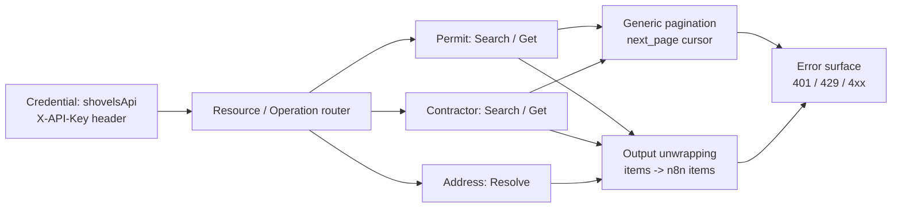

# n8n-nodes-shovels

[](https://github.com/jakemorganlabs/shovels_n8n_nodes/actions/workflows/publish.yml)
[](https://www.npmjs.com/package/n8n-nodes-shovels)
[](https://www.npmjs.com/package/n8n-nodes-shovels)

> A zero-dependency n8n community node for the [Shovels REST API](https://docs.shovels.ai) — building permits and contractors across 1,800+ U.S. jurisdictions. Published from CI with an OIDC-signed provenance attestation.

**Status:** `v1.0.0` — published to [npm](https://www.npmjs.com/package/n8n-nodes-shovels) with OIDC-signed build provenance. Verification submission to the n8n Creator Portal is **pending** (operator step). Pre-shield, the claim is "published with OIDC-signed build provenance; verification in review" — never "verified."

---

## What it does

Shovels provides building-permit and contractor data across the United States. This node lets n8n users query that data declaratively: pick a resource (`Permit`, `Contractor`, `Address`), pick an operation (`Search`, `Get`, `Resolve`), set the fields, and the node handles the authenticated HTTP calls, cursor pagination, and response unwrapping automatically — no code required inside the workflow.

The entire integration is routing configuration (JSON + TypeScript declarations). There is no runtime HTTP client, no parser library, no state management, and no dependency beyond n8n's own peer contract. The node was built as a four-session engineering exercise with explicit requirements, acceptance criteria, and a controlled SRS/TDD document — not as an ad-hoc script.

---

## What it looks like

_*(Hero visual slots — operator capture after first install)*_

| Community node install | Configured on canvas |
|---|---|
| `docs/img/install-community-node.png` — Settings → Community Nodes → Install | `docs/img/node-configured.png` — Shovels node with Permit Search selected |

Both screenshots should be captured from a live n8n instance and committed to `docs/img/`.

---

## Architecture

The node is pure declarative routing: n8n reads the `description` object, renders the UI, and executes the HTTP lifecycle using its own internal transport.



**How to read this:** The credential authenticates every request. The resource/operation router selects the endpoint and HTTP method. Search operations attach generic cursor pagination (walk `next_page` until exhausted). All operations unwrap the `items` array so each API record becomes one n8n output item. Errors surface astyped n8n errors (401 = credential, 429 = retryable, empty = valid query with no matches). The simplicity is deliberate — the node contains zero imperative business logic.

---

## Operations

| Resource | Operation | Endpoint | Pagination | Notes |
|----------|-----------|----------|------------|-------|
| **Permit** | Search | `GET /permits/search` | Return All or Limit 1–500 | `geo_id` + date window required |
| **Permit** | Get | `GET /permits/{id}` | — | Single record by Shovels ID |
| **Contractor** | Search | `GET /contractors/search` | Return All or Limit 1–500 | Same structure as Permit Search |
| **Contractor** | Get | `GET /contractors/{id}` | — | Single record by Shovels ID |
| **Address** | Resolve | `GET /addresses/search` | — | Free-form address -> `geo_id` candidates |

**Geo ID resolution:** State codes (`CA`) and ZIP codes (`94103`) are valid `geo_id`s directly. Cities, counties, and street addresses must be resolved through the **Address → Resolve** operation first.

---

## Install & use

### From npm (community node)

In self-hosted n8n:

```bash
npm install n8n-nodes-shovels
```

Or via **Settings → Community Nodes** in the n8n editor.

### From source (development)

```bash
git clone https://github.com/jakemorganlabs/shovels_n8n_nodes.git
cd shovels_n8n_nodes
npm install
npm run build               # tsc + svg copy
npm link
# In your n8n project:
npm link n8n-nodes-shovels
```

Credentials: create a **Shovels API** credential with your API key. Test connection validates against `/permits/search?geo_id=CA&size=1`.

A runnable example workflow is included in [`examples/permits-by-address.json`](examples/permits-by-address.json): resolve address → geo_id → search permits → paginate.

---

## Zero runtime dependencies

`package.json#dependencies` is intentionally empty. The node relies entirely on n8n's peer-provided `INodeTypeDescription` and internal HTTP transport. This matters for a community node because every dependency is a supply-chain surface — fewer dependencies means less audit surface, faster install, and no transitive vulnerability exposure.

---

## Security posture

| Guarantee | How it is enforced |
|-----------|-----------------|
| Zero runtime dependencies | `dependencies: {}` in `package.json`; verified by `@n8n/scan-community-package` |
| No filesystem access | Source contains no `fs`, `path`, or `require('fs')` |
| No environment access | Source contains no `process.env` reads |
| Publish only via CI | `.github/workflows/publish.yml` — local `npm publish` never used for verification-bound versions |
| OIDC-signed provenance | `id-token: write` + `--provenance` flag; npm attestation links to repo + commit + workflow |
| Scan gate blocks publish | CI runs `@n8n/scan-community-package` before publish; non-zero exit stops the release |
| No secrets in repo | `scripts/secret_gate.sh` blocks commits containing `_authToken` or npm tokens |
| Credential isolation | API key lives only in n8n's encrypted credential store; never in source, logs, or output |

---

## Provenance & verification

This package is published to npm by a named GitHub Actions workflow from a tagged commit, with an OIDC-signed provenance attestation. Anyone can verify that the tarball on npm was built by this exact workflow, from this exact repository, at this exact commit — trust is a property of the pipeline, not of trusting the author.

- **npm provenance panel:** See the [package page](https://www.npmjs.com/package/n8n-nodes-shovels) for the signed attestation.
- **CI pipeline:** See [`.github/workflows/publish.yml`](.github/workflows/publish.yml).
- **Provenance evidence:** Screenshots committed in [`docs/provenance/`](docs/provenance/).

**Verification status:** Published v1.0.0 on 2026-07-12 with OIDC-signed build provenance (sigstore transparency log: [logIndex 2150594713](https://search.sigstore.dev/?logIndex=2150594713)). Creator Portal submission **pending** — verification in review (not granted). Once the verified shield is granted, this line will be updated.

---

## Run it yourself

Quickstart (local self-hosted n8n):

```bash
# 1. Build the node
npm install
npm run build

# 2. Link into your local n8n
npm link
# In your n8n project directory:
npm link n8n-nodes-shovels

# 3. Restart n8n
# The node appears in the nodes panel under the Shovels icon.
```

For production operation, credential setup, and troubleshooting, see [`docs/runbook.md`](docs/runbook.md).

---

## Repo map

```
.
├── credentials/
│   └── ShovelsApi.credentials.ts      # API key credential + test request
├── nodes/
│   └── Shovels/
│       ├── Shovels.node.ts           # Declarative routing: resources, operations, fields
│       └── shovels.svg               # Node icon (MIT-licensed from Heroicons)
├── dist/                             # Build output (not committed; generated by tsc)
├── docs/
│   ├── shovels_node_srs_tdd.html     # SRS/TDD — baselined spec this build implements
│   ├── runbook.md                    # Operator manual: build, publish, rollback, closeout
│   ├── verification.md             # Creator Portal submission + compliance checklist
│   ├── worked-example.md           # Step-by-step walkthrough with field values
│   ├── evidence/                   # Scan output + provenance screenshots + index
│   ├── provenance/                 # npm provenance panel screenshots (closeout)
│   └── img/                        # README hero screenshots (operator capture)
├── examples/
│   └── permits-by-address.json     # Importable workflow: resolve -> search -> paginate
├── scripts/
│   └── secret_gate.sh              # Pre-commit secret scanner
├── .github/workflows/
│   └── publish.yml                   # CI pipeline: build -> scan -> publish with provenance
├── package.json                      # Zero dependencies, n8n block, MIT
├── CHANGELOG.md                      # v1.0.0 release notes
├── LICENSE                           # MIT
└── README.md                         # This file
```

---

## Docs index

| Document | What it covers | Link |
|----------|---------------|------|
| **SRS/TDD** | Baselined requirements, acceptance criteria, trace matrix | [View raw](docs/shovels_node_srs_tdd.html) — *(hosted render: `__OPERATOR__`)* |
| **Runbook** | Build, publish, rollback, closeout protocol | [`docs/runbook.md`](docs/runbook.md) |
| **Worked example** | Step-by-step address-to-permits walkthrough | [`docs/worked-example.md`](docs/worked-example.md) |
| **Verification** | Creator Portal submission, compliance checklist | [`docs/verification.md`](docs/verification.md) |
| **Evidence** | Scan output, provenance screenshots, review log | [`docs/evidence/`](docs/evidence/) |
| **Changelog** | Release history and known limitations | [`CHANGELOG.md`](CHANGELOG.md) |

---

## Portfolio cross-link

> **Part of a five-piece portfolio.** This is Piece III — supply-chain discipline: zero runtime dependencies, published only by CI with OIDC-signed provenance.
> Piece I `intake-n-outbound.pipeline` · Piece II `document-intelligence-rag` · Piece IV `recon_multiagent` · Capstone `fieldops`
>
> FIELD-005 explicitly reuses this piece's discipline: it is available to the capstone as an optional enrichment tool, and its CI provenance pattern is reused by Piece IV's release pipeline.

---

## License

MIT © Jake Morgan. See [`LICENSE`](LICENSE) for details.

---

**Author:** Jake Morgan · `jakemorganlabs` portfolio (`__OPERATOR__: URL`)

LinkedIn: `__OPERATOR__: URL` · Contact: `__OPERATOR__: email`

---

> *"The integration is configuration; the release is a proof."*
