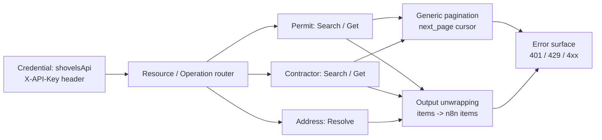

# n8n-nodes-shovels

[](https://github.com/jakemorganlabs/shovels_n8n_nodes/actions/workflows/publish.yml)
[](https://www.npmjs.com/package/n8n-nodes-shovels)
[](https://www.npmjs.com/package/n8n-nodes-shovels)
[](https://www.npmjs.com/package/n8n-nodes-shovels)

> A zero-dependency n8n community node for the [Shovels REST API](https://docs.shovels.ai). Building permits and contractors across 1,800+ U.S. jurisdictions. Published from CI with an OIDC-signed provenance attestation.

**Status:** `v1.0.9` on [npm](https://www.npmjs.com/package/n8n-nodes-shovels) with OIDC-signed build provenance. **n8n Creator Portal Verified.**

## What it does

1. Pick a resource: `Permit`, `Contractor`, or `Address`.
2. Pick an operation: `Search`, `Get`, or `Resolve`.
3. Set the fields.

The node handles the authenticated HTTP calls, the cursor pagination, and the response unwrapping. No code lives inside the workflow.

The integration is routing configuration only: JSON plus TypeScript declarations. There is no runtime HTTP client, no parser library, no state, and no dependency beyond n8n's peer contract. It is built against an SRS/TDD with acceptance criteria. It is not an ad-hoc script.

## Architecture

n8n reads the `description` object, renders the UI, and runs the HTTP lifecycle on its own transport.


```mermaid
flowchart LR
    A[Credential: shovelsApi<br/>X-API-Key header] --> B[Resource / Operation router]
    B --> C1[Permit: Search / Get]
    B --> C2[Contractor: Search / Get]
    B --> C3[Address: Resolve]
    C1 --> D[Generic pagination<br/>next_page cursor]
    C2 --> D
    C1 --> E[Output unwrapping<br/>items -> n8n items]
    C2 --> E
    C3 --> E
    D --> F[Error surface<br/>401 / 429 / 4xx]
    E --> F
```

The credential authenticates every request. The router selects the endpoint and the method. Search operations attach generic cursor pagination that walks `next_page` until the result set is exhausted. All operations unwrap the `items` array, so each API record becomes one n8n output item. Errors surface as typed n8n errors: 401 is a credential error, 429 is retryable, and an empty result is a valid query with no matches. There is zero imperative business logic.

## Operations

| Resource | Operation | Endpoint | Pagination | Notes |
|---|---|---|---|---|
| Permit | Search | `GET /permits/search` | Return All or Limit 1–500 | `geo_id` + date window required |
| Permit | Get | `GET /permits/{id}` | none | Single record by Shovels ID |
| Contractor | Search | `GET /contractors/search` | Return All or Limit 1–500 | Same shape as Permit Search |
| Contractor | Get | `GET /contractors/{id}` | none | Single record by Shovels ID |
| Address | Resolve | `GET /addresses/search` | none | Free-form address to `geo_id` candidates |

**NOTE:** State codes (`CA`) and ZIP codes (`94103`) are valid `geo_id` values directly. Cities, counties, and street addresses must go through `Address: Resolve` first.

## Install

From npm, in self-hosted n8n:

```bash
npm install n8n-nodes-shovels
```

Or use **Settings → Community Nodes** in the n8n editor. The node is verified, so it also installs in one click from the nodes panel on self-hosted and Cloud.

From source:

```bash
git clone https://github.com/jakemorganlabs/shovels_n8n_nodes.git
cd shovels_n8n_nodes
npm install
npm run build
npm link
# In your n8n project:
npm link n8n-nodes-shovels
```

Create a Shovels API credential with your API key. The connection test hits `/permits/search?geo_id=CA&size=1`.

A runnable example workflow is in `examples/permits-by-address.json`: resolve an address to a `geo_id`, search permits, paginate.

**NOTE:** Run local n8n on Node 22 (`npx n8n`). n8n rejects Node 24. Pin the Node version before you test.

## Zero runtime dependencies

`package.json#dependencies` is empty. The node leans on n8n's peer-provided `INodeTypeDescription` and internal HTTP transport. For a community node, every dependency is a supply-chain surface. Fewer dependencies mean a smaller audit surface, a faster install, and no transitive exposure.

## Security posture

| Guarantee | How it is enforced |
|---|---|
| Zero runtime dependencies | `dependencies: {}` in `package.json`; verified by `@n8n/scan-community-package` |
| No filesystem access | Source contains no `fs`, `path`, or `require('fs')` |
| No environment access | Source contains no `process.env` reads |
| Publish only via CI | `.github/workflows/publish.yml`; local `npm publish` is never used for verification-bound versions |
| OIDC-signed provenance | `id-token: write` + `--provenance`; the npm attestation links to repo, commit, and workflow |
| Scan gate blocks publish | CI runs `@n8n/scan-community-package` before publish; a non-zero exit stops the release |
| No secrets in repo | `scripts/secret_gate.sh` blocks commits that contain `_authToken` or npm tokens |
| Credential isolation | The API key stays in n8n's encrypted credential store; never in source, logs, or output |

## Provenance and verification

Every release is published by a named GitHub Actions workflow from a Release event, with an OIDC-signed provenance attestation. Anyone can verify that the tarball on npm was built by this workflow, from this repo, at this commit. Trust is a property of the pipeline, not of the author.

- npm provenance panel: see the package page.
- CI pipeline: `.github/workflows/publish.yml`.
- Provenance screenshots and the per-version transparency-log ledger: `docs/provenance/`.

**Verification status:** Granted. The n8n Creator Portal reviewed the package and verified it in August 2026. The first stable release, v1.0.0, published 2026-07-12 (logIndex 2150594713). The current release is v1.0.9.

**NOTE:** The publish workflow fires on the GitHub **Release published** event. A push or a bare tag does not publish. npm rejects a republish of an existing version number; a 403 on publish means the version already landed, so bump the patch version instead of a retry.

## Run it

```bash
npm install
npm run build
npm link
# In your n8n project directory:
npm link n8n-nodes-shovels
# Restart n8n
```

The node appears in the nodes panel under the Shovels brand icon. For production operation, credential setup, and troubleshooting, see `docs/runbook.md`.

## Repo map

```
.
├── credentials/
│   └── ShovelsApi.credentials.ts      # API key credential + test request
├── nodes/
│   └── Shovels/
│       ├── Shovels.node.ts            # Declarative routing: resources, operations, fields
│       └── shovels.svg                # Node icon (SVG)
├── dist/                              # Build output (not committed; generated by tsc)
├── docs/
│   ├── SRS-TDD.md                     # Controlled document, Rev 1.1 as built
│   ├── runbook.md                     # Operator manual: build, publish, rollback, closeout
│   ├── verification.md                # Creator Portal submission + compliance checklist
│   ├── worked-example.md              # Step-by-step walkthrough with field values
│   ├── evidence/                      # Scan output + provenance screenshots + index
│   ├── provenance/                    # npm provenance panel screenshots
│   └── img/                           # README hero screenshots
├── examples/
│   └── permits-by-address.json        # Importable workflow: resolve -> search -> paginate
├── scripts/
│   └── secret_gate.sh                 # Pre-commit secret scanner
├── .github/workflows/
│   └── publish.yml                    # CI pipeline: build -> scan -> publish with provenance
├── package.json                       # Zero dependencies, n8n block, MIT
├── CHANGELOG.md                       # Release history
├── LICENSE                            # MIT
└── README.md                          # This file
```

## Docs index

| Document | Covers | Link |
|---|---|---|
| SRS/TDD | Rev 1.1 as built: requirements, acceptance criteria, and the change record vs the 1.0 baseline | [docs/SRS-TDD.md](docs/SRS-TDD.md) |
| Runbook | Build, publish, rollback, closeout protocol | [docs/runbook.md](docs/runbook.md) |
| Worked example | Step-by-step address-to-permits walkthrough | [docs/worked-example.md](docs/worked-example.md) |
| Verification | Creator Portal submission, compliance checklist | [docs/verification.md](docs/verification.md) |
| Evidence | Scan output, provenance screenshots, review log | [docs/evidence/](docs/evidence/) |
| Changelog | Release history and known limitations | [CHANGELOG.md](CHANGELOG.md) |

## Portfolio cross-link

Part of a five-piece portfolio. This is Piece III: supply-chain discipline. Zero runtime dependencies, published only by CI with OIDC-signed provenance. Piece I `intake-n-outbound.pipeline` / Piece II `document-intelligence-rag` / Piece IV `recon_multiagent` / Capstone `fieldops`.

FIELD-005 reuses this piece's discipline: the node is available to the capstone as an optional enrichment tool, and Piece IV's release pipeline reuses its CI provenance pattern.

## License

MIT © Jake Morgan. See LICENSE.
